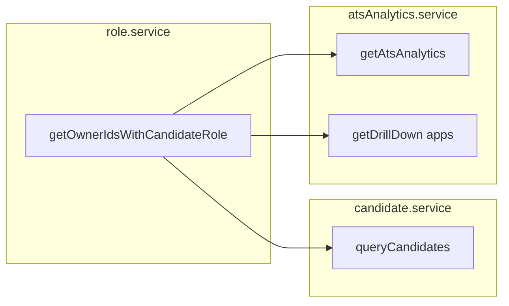

# fix: Align ATS analytics candidate counts with Candidate-role owners

## Overview

Backend ATS analytics (`getAtsAnalytics` and related drill-down) currently counts **all** active `Candidate` documents and uses **all** active candidate IDs for application aggregates. The ATS Candidates **list** API (`queryCandidates`) only includes rows whose **`owner`** user has the **Candidate** role (`active` or `pending`), including users with multiple roles. This plan adds the same owner constraint to analytics and centralizes the lookup so the two paths cannot drift.

## Problem Frame

- **User-visible issue:** Dashboard / analytics **Total Candidates** (and derived application metrics) can exceed the Candidates list total and diverge from “who we treat as a candidate” in the product sense.
- **Root cause:** `atsAnalytics.service.js` uses `Candidate.countDocuments` / `Candidate.find` on `{ isActive: { $ne: false } }` without filtering `owner` by Candidate role; `candidate.service.js` applies an explicit `owner ∈ usersWithCandidateRole` filter.

## Requirements Trace

- **R1.** Only users who have the **Candidate** role (alone or among other roles) define which **Candidate** documents count toward analytics totals and toward the `activeCandidateIds` set used for applications.
- **R2.** Recruiter-scoped analytics retain existing recruiter filters (`assignedRecruiter`, job ownership) **and** apply the same owner/role rule.
- **R3.** List and analytics share one implementation of “owner IDs for Candidate role” to avoid future drift.
- **R4.** No frontend changes required; consumers of `GET /v1/ats/analytics` automatically see aligned numbers.

## Scope Boundaries

- **In scope:** `role.service.js` helper, `candidate.service.js` `queryCandidates` refactor, `atsAnalytics.service.js` (`getAtsAnalytics`, `getDrillDown` application paths).
- **Out of scope:** Settings role user tables, training/student counts, changing list API semantics, migrations/backfills for legacy `owner` data.

## Context & Research

### Relevant Code and Patterns

- `uat.dharwin.backend/src/services/atsAnalytics.service.js` — `candidateMatch`, `activeCandidateIds`, `getDrillDown` application branches.
- `uat.dharwin.backend/src/services/candidate.service.js` — `queryCandidates` owner filter (dynamic `getRoleByName` + `User.find` today).
- `uat.dharwin.backend/src/services/role.service.js` — `getRoleByName`, existing `User` usage.
- Prior design note: `uat.dharwin.backend/docs/plans/2025-02-19-ats-analytics-design.md` described admin analytics as “org-wide” for candidates; **this fix refines** candidate cardinality to match list semantics (role-bearing owners only). Jobs/recruiters/activity scoping unchanged except application metrics now keyed to eligible candidate IDs.

### Institutional Learnings

- No `docs/solutions/` entries found for this topic.

### External Research

- Skipped: behavior is internal Mongo query alignment; Mongoose `{ roleIds: roleId }` already matches users with multiple roles.

## Key Technical Decisions

- **Single helper on `role.service`:** Expose something like `getOwnerIdsWithCandidateRole()` returning `ObjectId[]`, using `getRoleByName('Candidate')` and `User.find({ roleIds: candidateRole._id, status: { $in: ['active', 'pending'] } })`, mirroring `queryCandidates` exactly.
- **Empty role / no users:** Use `owner: { $in: [] }` so counts are zero (same as list when no eligible owners).
- **Application metrics:** Recompute `activeCandidateIds` with `{ isActive: { $ne: false }, owner: ownerFilter }` so funnels and counts exclude applications tied only to non–role-owner profiles.

## Open Questions

### Resolved During Planning

- **Multi-role users:** Already satisfied — query matches any user whose `roleIds` contains the Candidate role id.

### Deferred to Implementation

- **Performance:** One extra `User.find` per analytics request; acceptable; optimize with caching only if profiling shows need.

## High-Level Technical Design

> *This illustrates the intended approach and is directional guidance for review, not implementation specification. The implementing agent should treat it as context, not code to reproduce.*

## Implementation Units

- [ ] **Unit 1: Candidate-role owner helper**

**Goal:** One exported function returns owner user ids for users with Candidate role (`active` or `pending`).

**Requirements:** R3

**Dependencies:** None

**Files:**

- Modify: `uat.dharwin.backend/src/services/role.service.js`
- Test: `uat.dharwin.backend/tests/unit/role.service.candidateRole.test.js` *(new — only if test runner is wired; see Verification)*

**Approach:**

- Implement helper using existing `getRoleByName` and `User` model; return empty array when role missing.

**Patterns to follow:**

- Same filter as current `queryCandidates` block in `candidate.service.js`.

**Test scenarios:**

- **Happy path:** Candidate role exists; two users (`active`, `pending`) with that role in `roleIds`; helper returns both ids.
- **Edge case:** No Candidate role document — returns `[]`.
- **Edge case:** Candidate role exists but no users — returns `[]`.
- **Edge case:** User has Candidate role plus another role — user id still included.

**Verification:**

- Helper returns stable results for known fixtures; eslint passes on touched files.

---

- [ ] **Unit 2: queryCandidates uses helper**

**Goal:** Remove duplicated `getRoleByName` / `User.find` logic; call shared helper for `mongoFilter.owner`.

**Requirements:** R3

**Dependencies:** Unit 1

**Files:**

- Modify: `uat.dharwin.backend/src/services/candidate.service.js`
- Test: `uat.dharwin.backend/tests/unit/role.service.candidateRole.test.js` *(covers helper; list behavior verified via integration or manual — see below)*

**Approach:**

- Replace inline dynamic import block with import/call to helper; preserve `filter.owner` intersection behavior when present.

**Patterns to follow:**

- Existing owner `$in` / empty `$in: []` semantics.

**Test scenarios:**

- **Integration / manual:** List endpoint with default filters returns same row set before/after when data unchanged (spot-check staging).
- **Edge case:** `filter.owner` not in candidate-role set — still yields no rows (unchanged intent).

**Verification:**

- No regression in list filtering; single code path for role resolution.

---

- [ ] **Unit 3: ATS analytics and drill-down**

**Goal:** Apply `owner` filter to `candidateMatch`, recompute `activeCandidateIds`, and align `getDrillDown` application queries.

**Requirements:** R1, R2, R4

**Dependencies:** Unit 1

**Files:**

- Modify: `uat.dharwin.backend/src/services/atsAnalytics.service.js`
- Test: *No dedicated analytics test file in repo; use manual/API verification below*

**Approach:**

- At start of `getAtsAnalytics`, resolve owner ids once; merge into `candidateMatch`; restrict `Candidate.find` for `activeCandidateIds` the same way.
- In `getDrillDown` for application-related types, build `activeCandidateIds` with identical rules (extract small local helper inside the service file if it reduces duplication).

**Patterns to follow:**

- Recruiter branch: `assignedRecruiter` + `isActive` + `owner` together.

**Test scenarios:**

- **Happy path (manual/API):** Admin `GET /v1/ats/analytics` — `totals.totalCandidates` equals count of active candidates whose owners have Candidate role (match list API total with same employment filter semantics where comparable).
- **Edge case:** Only non–role-owner candidate profiles exist — total candidates and application aggregates drop accordingly vs before.
- **Edge case:** Recruiter user — scoped counts still respect `assignedRecruiter` and only include role-eligible owners.
- **Integration:** Drill-down `applicationStatus` / `applicationFunnel` totals consistent with new `activeCandidateIds` scope.

**Verification:**

- Dashboard and ATS Analytics page show candidate totals aligned with Candidates list (same owner definition); no frontend deploy required.

## System-Wide Impact

- **Interaction graph:** `GET /v1/ats/analytics`, analytics drill-down endpoints consuming `getDrillDown`; any internal callers of `getAtsAnalytics`.
- **Error propagation:** Helper failures should surface like other service errors; empty owner list yields zeros, not thrown errors.
- **API surface parity:** Response shape unchanged; numeric fields may change meaning slightly (corrected).
- **Unchanged invariants:** Job counts, recruiter activity endpoints, candidate CRUD routes (except shared helper), frontend contracts.

## Risks & Dependencies

| Risk | Mitigation |
|------|------------|
| Stakeholders expect old “all documents” count | Document behavior change in release notes; aligns with list UX. |
| Legacy rows with null/missing `owner` | Excluded by `$in` filter (same as list). |

## Documentation / Operational Notes

- Optionally add one line to `docs/plans/2025-02-19-ats-analytics-design.md` or README noting candidate totals are **role-owner scoped**; not required for merge if release notes suffice.

## Sources & References

- **Origin:** User request and codebase analysis (see Requirements Trace)
- Related code: `uat.dharwin.backend/src/services/atsAnalytics.service.js`, `uat.dharwin.backend/src/services/candidate.service.js`, `uat.dharwin.backend/src/services/role.service.js`
- Related design: `uat.dharwin.backend/docs/plans/2025-02-19-ats-analytics-design.md`

## Confidence check (Phase 5.3)

- **Depth:** Lightweight–standard (three units, single subsystem).
- **Risk:** Low (query filter alignment, no schema migration).
- **Outcome:** No deepening pass required; structure is grounded in existing `queryCandidates` behavior.
