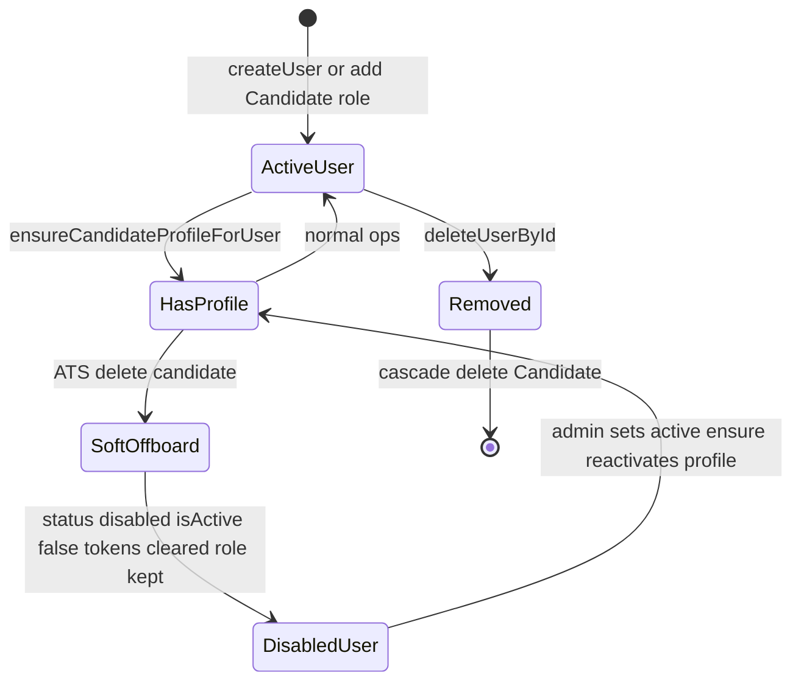

# feat: Candidate–User lifecycle sync (provision, cascade delete, ATS soft-offboard)

**Target repo / subtree:** `uat.dharwin.backend` (and minimal `uat.dharwin.frontend` notes only if UX copy is added).

---

## 📋 Plan: Candidate–User lifecycle sync

**Goal:** Every account with the Candidate role has a corresponding ATS `Candidate` profile when active; deleting the **User** removes ATS data; removing someone from the **ATS Candidates** experience disables the login and soft-hides the profile **without** stripping the Candidate role or deleting the User—matching admin expectations and common ATS practice.

**Estimated Timeline:** 2–5 engineering days (core change 0.5–1 day; optional logging, auth verification, backfill, and UX copy 1–4 days).

**Difficulty Level:** 🟡 Medium — small code diff but touches **auth**, **roles**, and **data integrity**; requires explicit regression checks and clarity for support/ops.

---

## 🔍 Research & Key Facts

Recruitment and HR platforms routinely **separate “inactivate / lock / deactivate” from “permanent delete.”** OnboardCentric’s guidance contrasts deactivation (profile retained, reversible, auditable) with deletion (typically irreversible, removes associated records such as correspondence and reporting hooks) ([Best Practice For Deactivating vs. Deleting a User](https://support.exacthire.com/onboardcentric-best-practice-for-deactivating-vs-deleting-a-user)). Paycor documents **inactivating or locking** a recruiting user as distinct from removing data from the hiring workflow ([Paycor — inactivate or lock a user](https://paycor.helpjuice.com/en_US/applicant-tracking-and-recruiting/recruiting-how-do-i-inactivate-or-lock-a-user)). That aligns with your product rule: ATS-side removal should **disable** the person in **Settings**, not destroy the User row.

From a **compliance** perspective, **hard deletion** of a person remains important when exercising **erasure** or retention limits. GDPR Article 17 (right to erasure) and ICO employment/recruitment guidance stress lawful basis, retention, and honoring deletion requests ([ICO — recruitment and selection](https://ico.org.uk/for-organisations/uk-gdpr-guidance-and-resources/employment/recruitment-and-selection); [Breezy HR — candidate’s right to erasure](https://help.breezy.hr/en/articles/5558057-gdpr-candidate-s-right-to-erasure)). Your existing **user hard-delete** path that cascades to `Candidate` and applications supports that “true removal” story when admins delete the User intentionally.

**Session revocation** on deactivation is standard SaaS hygiene: revoke tokens/sessions immediately on offboarding or lock-out ([WorkOS — session revocation](https://workos.com/blog/session-revocation-sign-out-everywhere)). Your `deleteCandidateById` already calls `Token.deleteMany({ user: ownerUser._id })`; that pattern should be **preserved** when adjusting role-stripping behavior.

**Synthesis for Dharwin:** Combine **soft ATS offboarding** (inactive candidate + disabled user + revoked tokens + **retain** Candidate role) with **hard user delete** (cascade remove candidate data) so admins have both operational modes without conflating them.

---

## Overview (technical)

Align backend behavior with stated lifecycle rules: provisioning via `ensureCandidateProfileForUser`, unchanged cascade on user delete, and **stop removing** the Candidate role when an ATS admin “deletes” a candidate (soft-delete profile + disable user only).

---

## Problem Frame

- Today, [`deleteCandidateById`](../../src/services/candidate.service.js) disables the user but also **removes** the Candidate role from `roleIds`, which contradicts “only disable in user list” and makes role-based reporting drift.
- Provisioning is **intended** via [`createUser`](../../src/services/user.service.js) / [`updateUserById`](../../src/services/user.service.js) → `ensureCandidateProfileForUser`, but failures are **swallowed**, allowing **User-with-role-but-no-Candidate** drift (observed as count mismatches elsewhere in the product).

---

## Requirements Trace

- **R1.** If a User has the Candidate role, the system should ensure an ATS `Candidate` document exists for `owner` when creating/updating that user (existing helper; reliability TBD).
- **R2.** When a User is **hard-deleted**, related `Candidate` data is removed (already implemented in `deleteUserById`).
- **R3.** When an ATS admin removes a candidate from ATS (current API: soft delete), the **User** must **not** be deleted; `status` becomes `disabled`; sessions invalidated; **Candidate role remains** on the user.
- **R4.** Reactivation: admin can set user back to `active`; `ensureCandidateProfileForUser` should reactivate an existing soft-deleted candidate document (already does when `isActive === false`).

---

## Scope Boundaries

- **In:** `deleteCandidateById` semantics; optional logging on `ensureCandidateProfileForUser`; auth verification for `disabled`; optional backfill/repair.
- **Out:** Bulk Excel import models that create orphan candidates without owners; changing employment/resign filters on the list; GDPR “self-service erase my data” flows (unless later scoped).

---

## Context & Research

### Relevant Code and Patterns

- [`src/services/candidate.service.js`](../../src/services/candidate.service.js) — `deleteCandidateById`, `ensureCandidateProfileForUser`.
- [`src/services/user.service.js`](../../src/services/user.service.js) — `createUser`, `updateUserById`, `deleteUserById`.
- [`src/models/user.model.js`](../../src/models/user.model.js) — `status` enum includes `disabled`.
- `uat.dharwin.frontend/app/(components)/(contentlayout)/settings/users/page.tsx` — displays/filters `disabled`.

### Institutional Learnings

- No `docs/solutions/` entry located for this topic.

### External References

- OnboardCentric: deactivate vs delete user ([support.exacthire.com](https://support.exacthire.com/onboardcentric-best-practice-for-deactivating-vs-deleting-a-user)).
- ICO / GDPR recruitment context ([ico.org.uk](https://ico.org.uk/for-organisations/uk-gdpr-guidance-and-resources/employment/recruitment-and-selection)).
- Session revocation patterns ([workos.com](https://workos.com/blog/session-revocation-sign-out-everywhere)).

---

## Key Technical Decisions

- **Keep Candidate role on ATS soft-delete:** Preserves “this person is still a Candidate-type account” in Settings and avoids surprising permission/role drops; `disabled` + `isActive: false` + token revocation enforce **no access**.
- **Do not change user hard-delete cascade:** Preserves a clear **erasure** path for true removal.
- **Logging before “fail closed” on provision:** Prefer `logger.warn` on ensure failures first; optional follow-up to fail user create if invariant must be absolute.

---

## High-Level Technical Design

> *Directional guidance for review, not implementation specification.*

---

## 🗂️ Project Phases & Step-by-Step To-Dos

**Phase 1: Core behavior change** *(0.5–1 day)*

> ATS “delete” becomes disable-only for identity; profile soft-deleted.

- [ ] Edit `deleteCandidateById`: remove `roleIds` filtering that drops Candidate role; keep `isActive`, `status`, tokens.
- [ ] Add inline comment documenting lifecycle rule for future maintainers.
- [ ] Manual test: ATS delete → user still in DB, `disabled`, role array unchanged, cannot log in.

**Phase 2: Safety & auth** *(0.5 day)*

> Confirm disabled users cannot obtain or use sessions.

- [ ] Trace login / JWT / passport (or equivalent) for `status === 'disabled'` rejection.
- [ ] Regression: `pending` and `active` still work; `deleted` if used remains consistent.

**Phase 3: Provisioning observability** *(0.5–1 day)*

> Reduce silent drift between User Roles count and ATS list.

- [ ] Replace `.catch(() => {})` on `ensureCandidateProfileForUser` in `createUser` / `updateUserById` with structured `logger.warn` (include `userId`, error message).
- [ ] Decide with stakeholders: optional **strict** mode (fail create/update if ensure throws).

**Phase 4: Data repair (optional)** *(0.5–2 days)*

> Fix historical orphans.

- [ ] One-off script or secured admin endpoint: Candidate role + active/pending + no `Candidate` → call `ensureCandidateProfileForUser`.
- [ ] Document runbook step for ops.

**Phase 5: UX clarity (optional)** *(0.5 day)*

> Reduce support tickets.

- [ ] Tooltip or help text: “Removing from ATS disables the user account; it does not delete the user record.”

---

## Implementation Units (ce-plan detail)

- [ ] **Unit 1: `deleteCandidateById` — disable without role strip**

**Goal:** Satisfy R3; keep audit-friendly User row.

**Requirements:** R3, R4

**Dependencies:** None

**Files:**

- Modify: `uat.dharwin.backend/src/services/candidate.service.js`
- Test: add an integration test for candidate delete lifecycle only if a dedicated backend test harness is added; otherwise use the manual checklist in Verification.

**Approach:** Delete only the `getRoleByName` / `roleIds.filter` block; preserve `isActive`, `status`, `Token.deleteMany`.

**Test scenarios:**

- **Happy path:** ATS delete → candidate `isActive false`, user `disabled`, Candidate role id still in `roleIds`, tokens gone.
- **Integration:** Reactivate user in Settings → `ensureCandidateProfileForUser` sets candidate `isActive true`.
- **Edge case:** Owner user missing (orphan candidate) — current code loads owner; confirm behavior unchanged or document if 404 path exists.

**Verification:** Manual API or UI flow matches scenarios; ESLint clean on touched file.

---

- [ ] **Unit 2: Auth guard for `disabled`**

**Goal:** R3 cannot be bypassed via stale tokens or alternate routes.

**Requirements:** R3

**Dependencies:** Unit 1

**Files:**

- Inspect/modify: `uat.dharwin.backend/src/middlewares/` and/or `uat.dharwin.backend/src/services/token.service.js` (exact files TBD during implementation)
- Test: same integration file or manual auth matrix

**Test scenarios:**

- **Happy path:** Login as disabled user → rejected.
- **Error path:** Valid refresh token after disable → rejected after token purge + status check.

**Verification:** Documented matrix signed off by implementer.

---

- [ ] **Unit 3: Provisioning logging**

**Goal:** Diagnose R1 violations without silent failure.

**Requirements:** R1

**Dependencies:** None (can parallelize with Unit 1)

**Files:**

- Modify: `uat.dharwin.backend/src/services/user.service.js`

**Test scenarios:**

- **Integration:** Force ensure failure in dev → log line contains user id and error.

**Verification:** Log appears in dev/staging; no PII beyond existing logging norms.

---

- [ ] **Unit 4 (optional): Backfill script**

**Goal:** Repair legacy Candidate-role users without profiles.

**Requirements:** R1

**Dependencies:** Unit 3 recommended first

**Files:**

- Optional one-off backfill (if needed): implement in-app or as a temporary maintenance route; no checked-in script.

**Test scenarios:**

- Dry-run mode counts would-be fixes; live run idempotent.

**Verification:** Staging row counts before/after recorded.

---

## System-Wide Impact

- **Interaction graph:** `DELETE /v1/candidates/:id`, Settings Users, login, analytics/list filters (`getOwnerIdsWithCandidateRole` uses `active`/`pending` — disabled users stay out of ATS counts).
- **Error propagation:** If ensure starts failing loudly, user onboarding paths must surface errors to admins.
- **Unchanged invariants:** `deleteUserById` cascade; public registration flows that already use `createUser`.

---

## ⚠️ Risks & Challenges

| Risk | Likelihood | Impact | Mitigation Strategy |
|------|------------|--------|---------------------|
| Disabled user still has Candidate permissions in a code path that ignores `status` | Med | High | Audit auth + permission middleware; add test or checklist |
| Role table “Total Users” still counts disabled users | Med | Low | Document; optional follow-up filter by `status` on Roles page |
| Strict ensure-on-create breaks edge registrations | Low | Med | Start with logging only; feature-flag strict mode |
| Support confusion: “deleted from ATS” vs “deleted user” | Med | Med | Optional UI copy in Phase 5 |
| Orphan candidates (no owner) unaffected by this plan | Low | Low | Separate backlog |
| Reactivation restores profile but not all related entities | Low | Med | Verify job applications expectations with product |
| Token race: user disabled mid-session | Low | Med | Rely on token delete + middleware status check |
| Compliance: soft-offboard retains PII | Med | Med | Align privacy notice; hard delete remains on User delete |

---

## 🛠️ Resources & Tools Needed

**People / Skills:** Backend engineer (Node/Mongoose), QA or engineer for auth regression, optional product copy for Settings.

**Tools & Software:** Existing stack (Express, MongoDB, JWT/session as implemented); no new licenses.

**Budget Estimate:** Internal engineering only — roughly **3–8 person-days** including optional phases (no vendor spend assumed).

**Learning Resources:** Internal docs `uat.dharwin.backend/docs/plans/2025-02-19-ats-analytics-design.md` for analytics scoping context; external ATS vendor help articles cited above for stakeholder communication.

---

## ✅ Definition of Success

1. ATS delete candidate → User exists, `status === 'disabled'`, Candidate role **still assigned**, candidate `isActive === false`, **no** valid sessions.
2. Admin sets user active → candidate profile becomes active again; user can authenticate.
3. User hard-delete → candidate rows removed (existing behavior preserved).
4. No increase in unexplained **User-with-Candidate-role-but-no-profile** cases after logging (or zero after backfill).
5. Stakeholders sign off on wording for admin-facing behavior (optional UX phase).

---

## 🚀 Recommended First 3 Actions (next 7 days)

1. **Implement Unit 1** (`deleteCandidateById`) and run the three manual scenarios in a dev environment.
2. **Verify auth** for disabled users on login and at least one authenticated API call path.
3. **Add `logger.warn`** on `ensureCandidateProfileForUser` failure and watch logs for one release cycle before considering strict fail-closed mode.

---

## Risks & Dependencies (summary)

| Risk | Mitigation |
|------|------------|
| Permission bypass for disabled | Auth audit in Unit 2 |
| Silent provision failures | Logging + optional backfill |

---

## Documentation / Operational Notes

- Update internal release notes: “ATS candidate removal disables user; does not remove Candidate role.”
- Optional: one paragraph in admin-facing wiki linking GDPR **hard delete** (User delete) vs **operational offboard** (ATS delete).

---

## Sources & References

- **Origin:** User request and Cursor plan `candidate-user_lifecycle_sync_f7f0ccfe`
- **Related code:** `uat.dharwin.backend/src/services/candidate.service.js`, `uat.dharwin.backend/src/services/user.service.js`
- **External:** OnboardCentric, ICO, WorkOS (URLs in Research section)

---

## Confidence check

- **Depth:** Standard (identity + ATS + optional ops).
- **Deepening:** Research pass completed; local codebase already mapped in origin plan. No additional sub-agent deepening required for execution readiness.

**Plan written to:** `uat.dharwin.backend/docs/plans/2026-04-13-002-feat-candidate-user-lifecycle-sync-plan.md`
